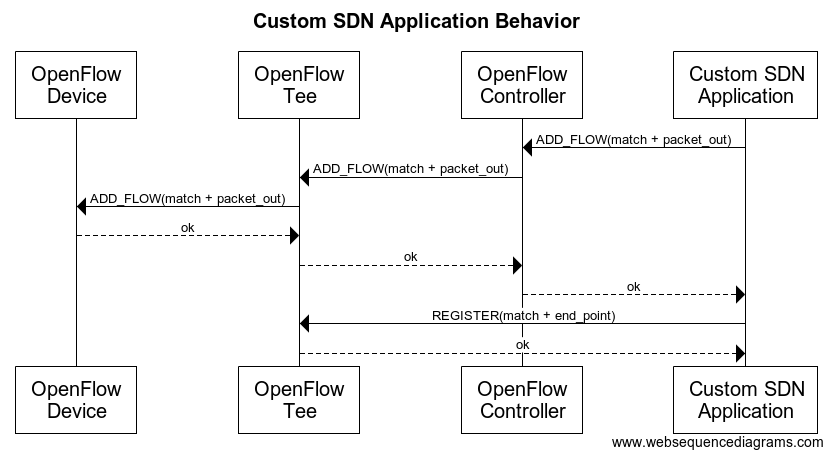
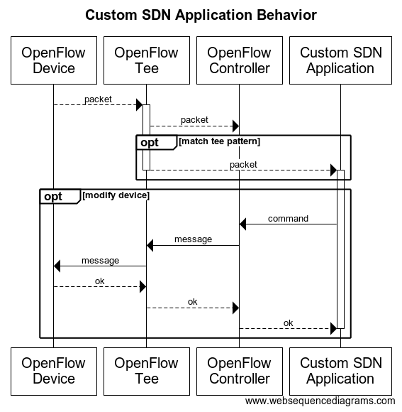

# OpenFlow Tee [](https://godoc.org/github.com/ciena/oftee)

This is a utility filter that sits between and OpenFlow device and the
OpenFlow controller. This filter bidirectionally passes, as is, all
traffic between the device and the controller. This filter
can be configured to *tee* OpenFlow *packet in* messages to third party
applications via `Kafka` (future) and `REST` as well as supports an API
(currently `REST` only) to *packet out* messages to a switch ports.

The purpose of this utility filter is to allow the development if SDN
applications that execute outside the SDN controller processes, i.e,
that don't have to be written for a specific SDN controller such as
`ONOS` or `ODL`.

## Quick Start
There is a sample work space github project at
[http://github.com/dbainbri-ciena/oftee_workspace](http://github.com/dbainbri-ciena/oftee_workspace).
Please visit this project to see `oftee` in action.

## SDN Application Initialization
To utilize the OpenFlow tee the *external* SDN application or operator
must perform some initialization so that the OpenFlow device does a
packet in to the controller on the desired packets and the *tee* forwards
the desired packets to the external SDN application.



## SDN Application Behavior
While the SDN application receives packet in packets from the OpenFlow
Tee, if should use the controller's API to influence an open flow device
or to emit a packet back into the open flow network. Because most SDN
controllers do not support and API to allow packet out emits to a device, this
application does support a `REST` API to support the capability.



It is possible and expected for the SDN to communicate over the network
to other services or applications outside the OpenFlow network.

## Application Configuration
The application is written in the style of a 12 factor application,
https://12factor.net/, and thus configured via environment variables. The
configuration information can be viewed by setting the environment variable
`HELP=true` or using the `--help` command line flag. This will display the
following information:

```
This application is configured via the environment. The following environment
variables can be used:

KEY                  TYPE                              DEFAULT      REQUIRED    DESCRIPTION
HELP                 True or False                     false                    show this message
LISTEN_ON            String                            :8000        true        connection on which to listen for an open flow device
API_ON               String                            :8002        true        port on which to listen to accept API requests
PROXY_TO             String                            :8001        true        connection on which to attach to an SDN controller
TEE_TO               Comma-separated list of String                             list of connections on which tee packet in messages
TEE_RAW              True or False                     false                    only tee raw packets to the client, openflow headers not included
LOG_LEVEL            String                            debug                    logging level
SHARE_CONNECTIONS    True or False                     true                     use shared connections to outbound end points
CPU_PROFILE          String                            cpu.pprof                file to which to write CPU profile data
MEM_PROFILE          String                            mem.pprof                file to which to write MEM profile data
```

### Tee Configuration
The `TEE_TO` configuration is a list of end points to which packet in messages
should be published. Each end point may include a set of match criteria
such that only packets that match the criteria will be forwarded. The format
of an individual end point configuration is:

```
criteria1=value1;criteria2=value2;...;action=http://remote.host:port/path
```

*example*
```
dl_type=0x8942;action=http://172.17.0.3:8000
```

Multiple end point configurations can be specified via the `TEE_TO` variable
by separating each entry with a "`,`" (comma).

#### Match Criteria
Currently, as of June 13, 2018, the following are the available match criteria:
- `dl_type` - Ethernet type expressed as a hexadecimal 16 bit value, i.e. 0x1234.

#### Action Specification
The action specification is a URL reference. Currently, as of June 13, 2018,
only `http` based URLs are supported.

### Proxy Configuration
The `PROXY_TO` configuration is a single end point that references the SDN
controller to which `oftee` should proxy OpenFlow messages. This is specified
`tcp://host:port`, *example*, `tcp://172.17.0.2:6653`

## Device Configuration
The `oftee` sits between OpenFlow devices and the SDN controller. The `oftee`
is configured to proxy to the SDN controller, typically port `6653` and the
devices are configured to use the `oftee` as their SDN controller. If `oftee` is
listening on port `8853` on IP `172.17.0.4` then the devices would set their
controller to `tcp:172.17.0.4:8853`.

## API
`oftee` supports five (5) REST endpoints:

- `/oftee` - `GET` - returns a `JSON` structure of the devices (DPIDs) known to `oftee`
- `/oftee/{dpid}` - `POST` - used to inject an OF packet out message to a device
- `/oftee/profile/cpu/start` - `POST` - starts a CPU profile session
- `/oftee/profile/cpu/stop` - `POST` - completes a CPU profile session
- `/oftee/profile/mem` - `POST` - creates a memory profile dump

## Credits
I have advocated for the disaggregation of the control plane, both
in the context of ONOS and ODL. This project originated out of a conversation
with and suggestion by _[Sergio](https://github.com/Sergio-Slobodrian)_
revolving around the topic of controller disaggregation.
